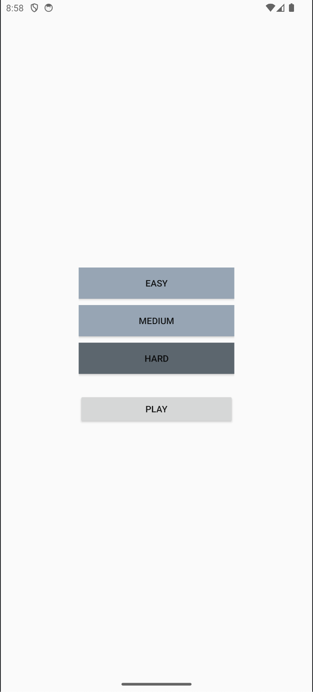
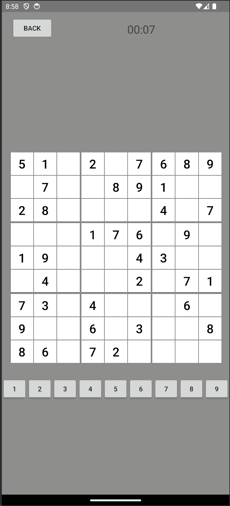
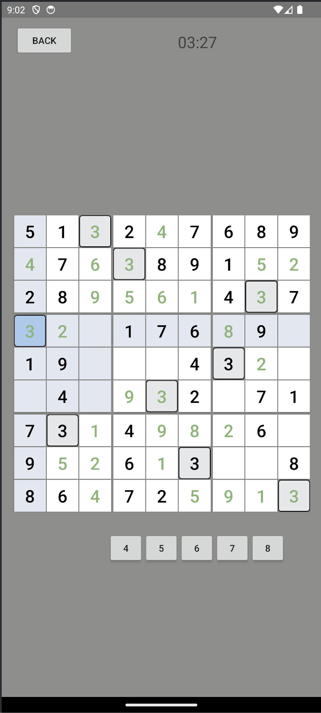
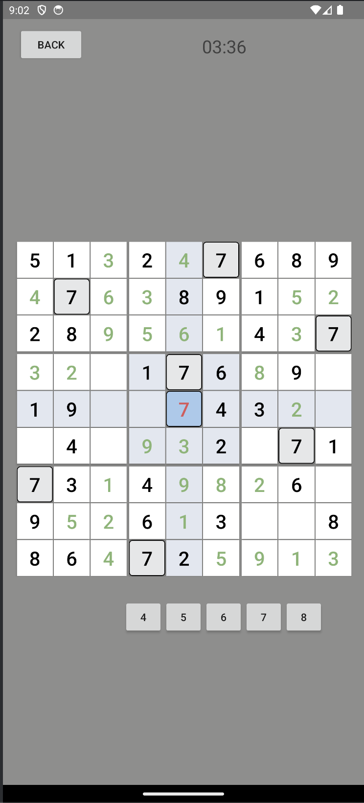

# Sudoku Mobile Game
### This is a sudoku puzzle solver game I wrote in Java using Android Studio

## Built With
- Android Studio
- Java

## Features
- Stores count of player wins and avg. time played using built in SharedPreferences class
- Timer creates a new thread that displays and records time taken to complete a puzzle
- locks value in place if correct number is placed into a square
- When a number has been used up, the player will no longer be able to place that number down
- Displays and keeps a locally stored record of the users average time and calculates new average whenever they complete a "hard" puzzle

## Installation
- Download Android Studio https://developer.android.com/studio
- Open project in Android Studio
- Run Application
### Or
- Load provided .apk (Sudoku.apk) onto an android phone and run (supports android 9+)

## Screenshots

| Main menu screen | Newely generated board | Finished numbers disappear |
| --- | --- | --- |
|  |  |  |

| Incorrect Answers Marked Red | Players Avg. Time Recorded |
|---|---|
|||

## Contact
Kirill Toptun - kirilltoptun@gmail.com
